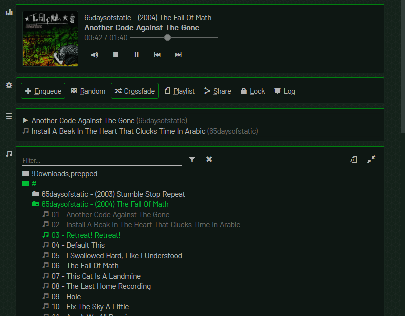

# Music Folder Player
by ltGuillaume: [Codeberg](https://codeberg.org/ltGuillaume) | [GitHub](https://github.com/ltGuillaume) | [Buy me a beer](https://buymeacoff.ee/ltGuillaume) 🍺

An elegant HTML5 web folder player for parties and/or private music collections, with a playlist system that all players should have had. It does not use a database (so it's alway up-to-date), but can easily handle folders with 25,000 songs or more. It has no dependencies other than PHP and installation costs less than 2 minutes. The design should be fully responsive on CSS3-compatible browsers.

## Overview

#### Player
- Click on cover image to zoom (300x300px, again for full size)
- Click on current song or folder name to find it in the library
- Right-click Volume to mute
- Right-click Next to skip current artist

#### Options
- Enqueue: Click on songs in the library to add songs to the end of the playlist, instead of playing them (next). Right-click to suggest a random song to enqueue.
- Random: pick the next song randomly from the upcoming songs (songs added using "Play next" take precedence)
	- Right-click Random to shuffle upcoming songs (songs added using "Play next" will stay in place)
- Crossfade: start playing the next song 10s before ending the current and fade out the current song
- Password lock the playlist and playlist controls (allowing only Enqueue, Play/pause and Share)
	- Tip: use [OpenKiosk](http://openkiosk.mozdevgroup.com) and disable _Set Inactive Terminal_
- Do not add previously played songs to playlist (optional)

#### Playlist

- Click on a song to play directly
- Drag and drop to change the order, drag to bin to remove
- Right-click a song to find it in the library
- Choose how to continue when the playlist is exhausted:
	- Stop playback
	- Repeat the playlist
	- Continue from the last played song's position in the library
	- Randomly select unplayed songs from the (filtered) library
- Playlist and configuration will be saved to the browser's Local Storage if possible
- Load/save online playlists (can be disabled)
- Import/export playlists from/to a local file

#### Library
- Rebuilds the tree of a specified folder, showing only files with supported extensions
- Use arrow keys to traverse the library tree, Enter to play/enqueue, or Shift-Enter to play next/add folder
- Click a song to play (or enqueue when "Enqueue" mode is enabled)
- Clicking on a song will never clear the playlist (looking at you, ol' Winamp)
- Play next: right-click (long-press) a song to play it next ("Play next" songs will play in "FIFO" order)
- Right-click a folder to add all its songs to the playlist
- Prevents adding a song if it's already queued up (unless "Play next" is used)
- Sports a library (instant) filter to quickly find songs

#### Sharing

- Download a song or zipped folder
- Share a song, folder or playlist link (library features/options will be disabled)
- Share links directly to email, social media or use your device's native share options (optional)

#### Themes
- Define your own subset of the available themes and variants in `music.ini`
- &nbsp;Black&nbsp;, &nbsp;blue&nbsp;, &nbsp;green&nbsp;, &nbsp;gray&nbsp; and &nbsp;light&nbsp; color themes
- Can be mixed with variants (see `music.theme.css`):
	- Material-like rounded UI and compact retro UI
	- Colorize &nbsp;hovered buttons&nbsp;
	- Blue, green, orange and pink focus colors
	- Indicate enabled options by colored borders instead of checkmarks
	- Decorative top border for main elements and bottom border for hovered buttons

#### Translations
- Currently includes Chinese, English, Dutch, Portuguese and Spanish
- Instructions for creating new translations can be found in the [Wiki](https://codeberg.org/ltguillaume/music-folder-player/wiki/Translations)

## List of hotkeys
A list of all the hotkeys can be found in the [Wiki](https://codeberg.org/ltguillaume/music-folder-player/wiki/List-of-hotkeys).

## Installation
You can have a test setup running within 2 minutes. For all the details, check the [Wiki](https://codeberg.org/ltguillaume/music-folder-player/wiki).

## Credits
- Some concepts of this project are based on the excellent [HTML5 Music Player](https://github.com/GM-Script-Writer-62850/HTML5-Music-Player) by [GM-Script-Writer-62850](https://github.com/GM-Script-Writer-62850)
- The [Barlow font](https://github.com/jpt/barlow) (Regular and Semi Condensed Regular) is used for text
- The [Foundation icon font](https://zurb.com/playground/foundation-icon-fonts-3) is used for all icons
- Album art placeholder is based on a [design by CmdRobot](http://fav.me/d7kpm65)

All credits are due, as well as my sincere thanks!